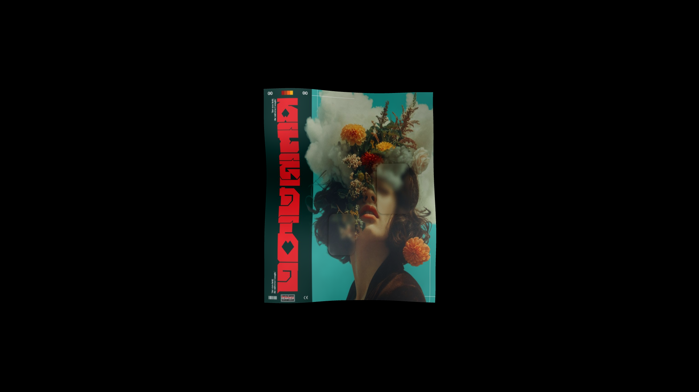

# ⚡ GLSL Image Distortion

🎥 A dynamic image distortion effect using GLSL shaders and Three.js. Applies flowing wave-like animations to textures in real-time using custom vertex and fragment shaders.

[](https://cyberpunk-landing-page-chi.vercel.app/)

---

## ✨ Features

- 🎥 **Real-Time Image Distortion** using custom GLSL vertex and fragment shaders
- 🌊 **Wave-Like Animation** driven by Perlin noise and time-based displacement
- 🎛️ **Interactive Shader Controls** via lil-gui for tweaking wave speed, height & noise strength
- 🖼️ **Texture Mapping** to apply custom images as animated surfaces
- 🧭 **OrbitControls Integration** for smooth camera interaction and inspection
- ⚙️ **High-Resolution Rendering** with adaptive pixel ratio and canvas resizing
- 💅 **Responsive Fullscreen** Layout styled with TailwindCSS

---

## 🧠 How It Works

- Loads a **custom texture** onto a high-resolution plane geometry using `THREE.ShaderMaterial`
- Applies **vertex displacement** using 3D Perlin noise based on time (`uTime`) and custom wave parameters
- Calculates **dynamic surface distortion** in the vertex shader to simulate flowing waves
- Enhances **visual texture** in the fragment shader with fbm-based noise blending
- Updates **wave behavior** in real-time using interactive GUI controls for speed, strength, and height
- Utilizes **OrbitControls** for smooth user interaction with the scene
- Adapts to **window resizing** with proper camera and renderer updates

---

## 🛠️ Built With

- [Three.js](https://threejs.org/) - 3D rendering
- [GLSL](https://thebookofshaders.com/) - Custom vertex and fragment shaders for wave distortion
- [TailwindCSS](https://tailwindcss.com/) - Utility-first CSS
- [lil-gui](https://github.com/georgealways/lil-gui) - Lightweight UI for real-time shader parameter control
- [OrbitControls](https://threejs.org/docs/#examples/en/controls/OrbitControls) - Camera interaction and movement
- [TextureLoader](https://threejs.org/docs/#api/en/loaders/TextureLoader) - Loads image textures applied to the mesh

---

## Clone the repo

```bash
git clone https://github.com/its-riki-dev/glsl-image-distortion.git

# Install dependencies
npm install

# Start the development server
npm run dev

# Build for production
npm run build

# Preview production build
npm run preview
```

---

## 📄 License

- This project is licensed under the MIT License.
